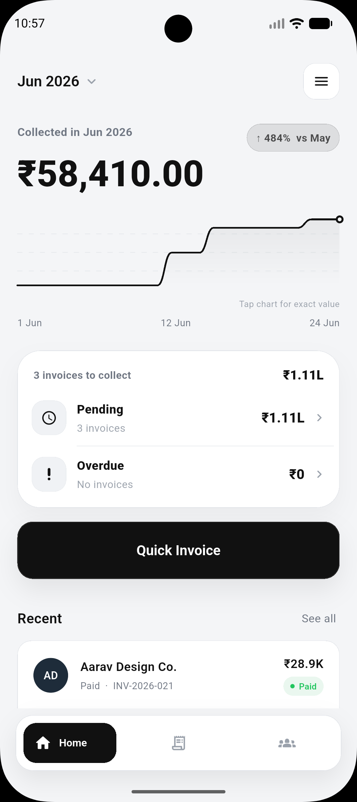
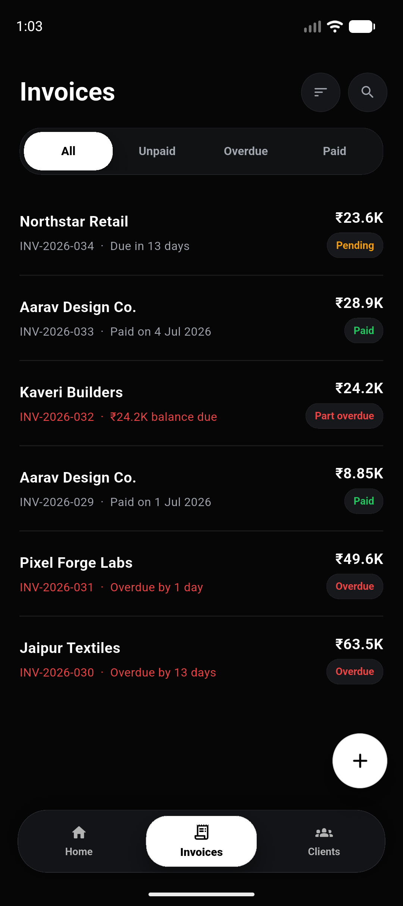
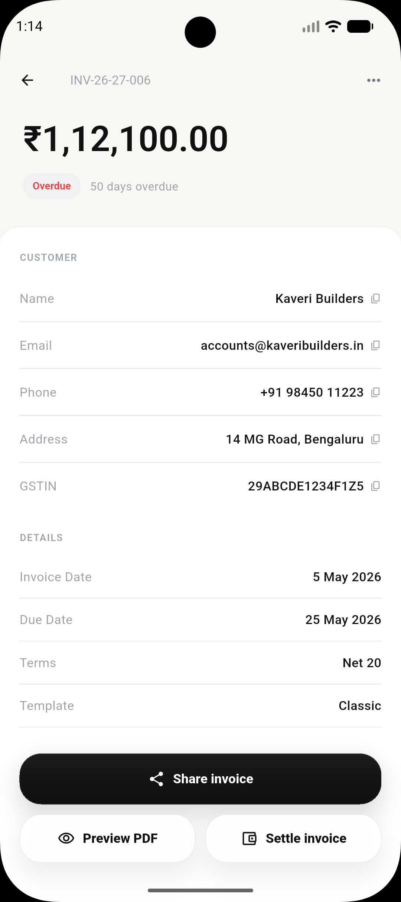
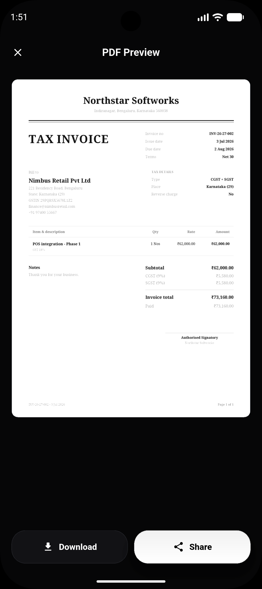

<div align="center">
  <h1>🧾 Invoy</h1>
  <p><b>Local-first invoicing for freelancers and small businesses.</b></p>
  <p>Create GST-ready invoices, track payments, manage clients, and export shareable PDFs — fully offline, no account required.</p>

  <br/>

  <a href="https://github.com/akashsgowda/invoy/releases/latest/download/Invoy-v2.1.4.apk">
    
  </a>

  <br/><br/>

  
  
  
  
  
</div>

<br/>

## Preview

<p align="center">
  
  &nbsp;
  
  &nbsp;
  
  &nbsp;
  
</p>
<p align="center">
  <sub><i>Dashboard&nbsp;&nbsp;·&nbsp;&nbsp;Invoices&nbsp;&nbsp;·&nbsp;&nbsp;Invoice detail&nbsp;&nbsp;·&nbsp;&nbsp;Exported PDF</i></sub>
</p>

> Android is the maintained platform target. Generated builds, APKs, signing
> keys, local app data, and exported PDFs are intentionally kept out of source
> control.

<br/>

## ✨ Features

<table>
<tr>
<td width="50%" valign="top">

**📄 Invoicing**
- GST-ready invoices — line items, discounts, due dates, payment status
- CGST/SGST & IGST, HSN/SAC codes, item units, reverse charge, place of supply
- Reusable saved items for faster billing
- Six invoice PDF templates

</td>
<td width="50%" valign="top">

**📊 Tracking**
- Paid, unpaid, overdue, draft, and part-paid status at a glance
- Dashboard view of collections over time

</td>
</tr>
<tr>
<td width="50%" valign="top">

**📤 Sharing & backups**
- Invoice and receipt PDFs, ready to share or save
- GST summary CSV export
- Local backup and restore

</td>
<td width="50%" valign="top">

**👥 Clients & profile**
- Clients and business profile stored on-device
- Optional UPI payment QR on unpaid invoices *(a payment QR, not an IRP e-invoice QR — Invoy does not generate an IRN)*

</td>
</tr>
</table>

<br/>

## 🚀 Development

```bash
flutter pub get
flutter analyze
flutter test
flutter build apk --release
```

APKs are published through GitHub Releases, not committed to this repository.

<br/>

## 🔒 Privacy

Invoy is local-first by design. Invoice, client, and business data stay on the
user's device unless the user exports, backs up, or shares it explicitly.
See [PRIVACY_POLICY.md](PRIVACY_POLICY.md) for details.

<br/>

## 📄 License

MIT — see [LICENSE](LICENSE).
