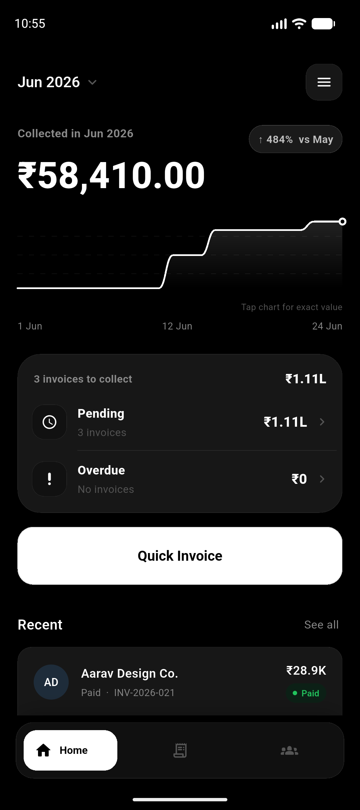
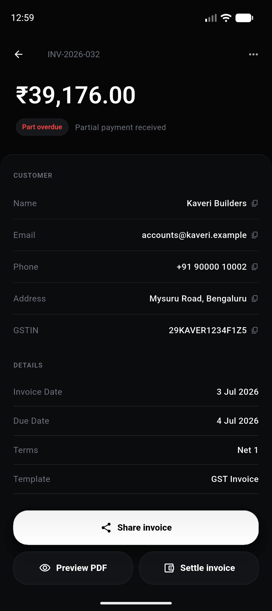
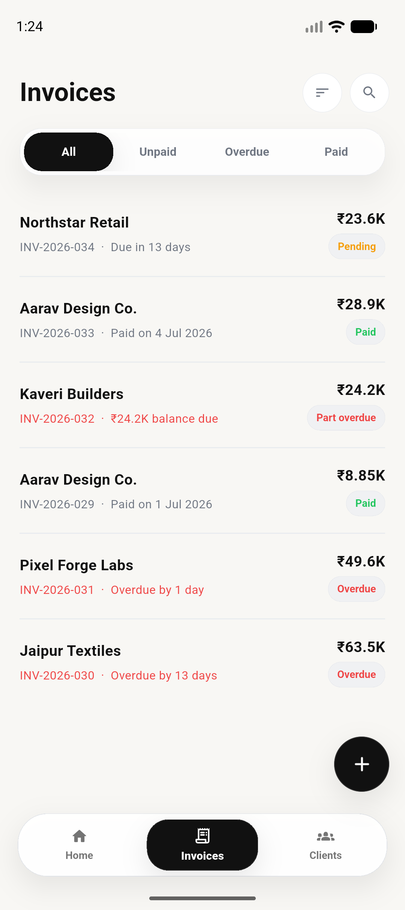
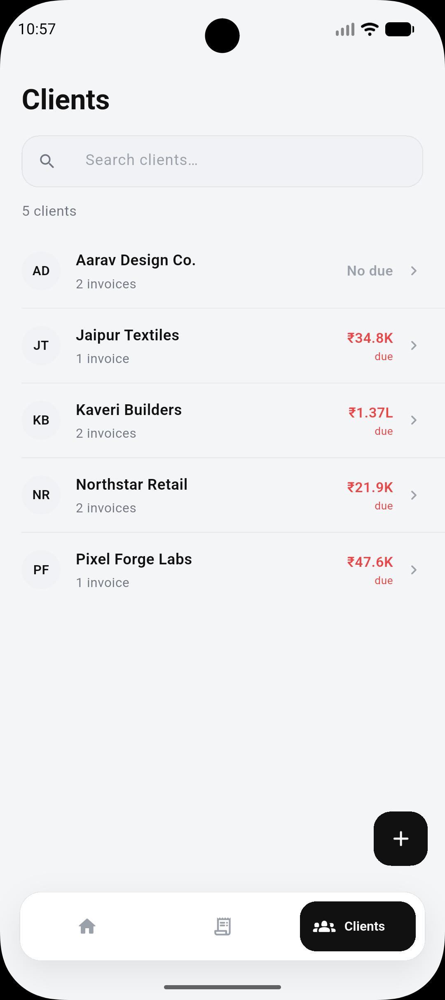

# Invoy

Invoy is an open-source Flutter invoice app for quick offline billing. It helps
small businesses and freelancers create invoices, track payment status, manage
clients, export backups, and generate shareable invoice PDFs.

<p align="center">
  <a href="https://github.com/akashsgowda/invoy/releases/latest/download/Invoy-v2.0.0.apk">
    
  </a>
</p>

<p align="center">
  <b>Download the latest Android APK from GitHub Releases.</b>
</p>

**Download:** https://github.com/akashsgowda/invoy/releases/latest/download/Invoy-v2.0.0.apk

## Screenshots

<p align="center">
  
  
  
  
</p>

The maintained platform target is Android. Generated builds, APKs, local app
data, signing keys, and exported PDFs are intentionally kept out of source
control.

## Features

- Create and manage GST-ready invoices with line items, discounts, due dates, and payment status.
- Support CGST/SGST and IGST, HSN/SAC codes, item units, reverse charge, and place of supply.
- Save reusable invoice items for faster billing.
- Track paid, unpaid, overdue, draft, and part-paid invoices.
- Generate invoice PDFs and receipt PDFs for sharing or saving outside the app.
- Export GST summary CSV files and restore app data using local backups.
- Store clients and business profile details locally on the device.
- Optional UPI payment QR support for unpaid invoices.

## Development

Install Flutter, then run:

```bash
flutter pub get
flutter analyze
flutter test
flutter build apk --release
```

APKs should be published through GitHub Releases, not committed to this
repository.

## Privacy

Invoy is designed for local-first use. Invoice, client, and business data stay
on the user's device unless the user exports, backs up, or shares that data.
See [PRIVACY_POLICY.md](PRIVACY_POLICY.md) for details.

## License

MIT. See [LICENSE](LICENSE).
